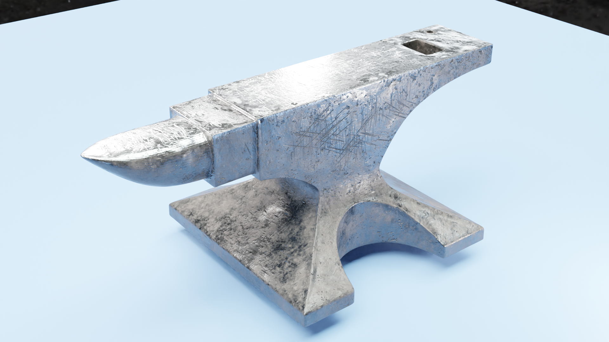

# blender_anvil
Here I make a 3D anvil roughly following [this tutorial](https://www.youtube.com/watch?v=yi87Dap_WOc&list=PLjEaoINr3zgHJVJF3T3CFUAZ6z11jKg6a) with [Blender 2.8](https://www.blender.org), just in case I ever need one, otherwise for fun. It's not quite done yet though.

Below, the anvil is rendered using cycles and a denoising filter (removes graininess). Not quite sure why it would be so scratched up on the sides, but just don't worry too much about it:

